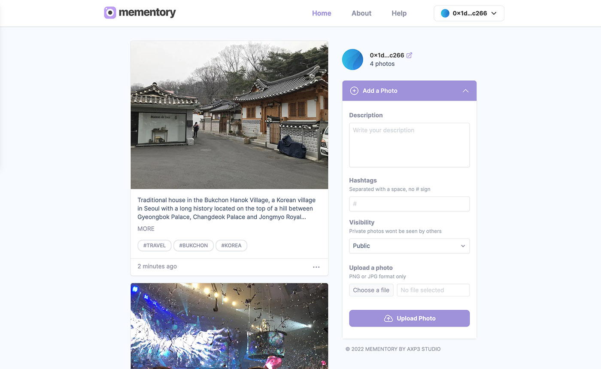

# Mementory - Decentralized Photo Album



**_Keep your memories in a safe place_**

Mementory is a Decentralized Application (DApp) running on the Avalanche Blockchain. It is an online Photo Album where users can connect their wallet to the application to access their dedicated space, and start posting photos in seconds. All photos uploaded are minted as ERC721 NFTs and stored on IPFS - a distributed file system protocol - to ensure that the album content stays permanently accessible.

The DAPP and its associated Smart Contract have been developed by the AXP3 Studio.

## The DApp

**DApp URL**: https://mementory.vercel.app/

The project is still in Beta phase, and deployed on Avalanche FUJI C-Chain, the testnet of the Avalanche network.

## Tech Stack

This is a Decentralized Application developed using:

- **Frontend JS library** - [React](https://reactjs.org/) + [Next.js](https://nextjs.org/)
- **Smart Contract language** - [Solidity](https://docs.soliditylang.org/en/v0.8.16/)
- **Solidity development environment** - [Hardhat](https://hardhat.org/)
- **Distributed storage** - [Infura IPFS](https://infura.io/product/ipfs)
- **Wallet Connect** - [Rainbowkit](https://www.rainbowkit.com/)
- **Ethereum web client library** - [Wagmi](https://wagmi.sh/) + [Ethers.js](https://docs.ethers.io/v5/)
- **CSS framework** - [Tailwind](https://tailwindcss.com/)

## Smart Contract

**Contract address**: [0xa5752af9D450adDF7fE12872a695848FAD32F8Ee](https://testnet.snowtrace.io/address/0xa5752af9D450adDF7fE12872a695848FAD32F8Ee)

The smart contract used to manage the DApp and mint photos as unique NFTs (ERC721 tokens) is deployed on Avalanche FUJI C-Chain (Beta phase).

## How to Use

### Connect a Wallet

To use the DApp, you need to have a wallet provider configured as a browser extension and create a wallet. Metamask is our recommended wallet extension (refer to this [guide](https://academy.binance.com/en/articles/how-to-use-metamask) for the setup).

Click on the button at the top of the page (or in the menu on mobile) to connect your wallet to the correct network.

### Add a Photo

Use the form called "Add a Photo” at the right side of the Homepage to upload a photo (PNG or JPG format) and fill a description for your photo, as well as optional hashtags. Your photo will be uploaded on IPFS, and you will need to confirm the transaction prompted by your Wallet Provider and pay a small gas fee to permanently add your photo to your album.

### Remove a Photo

Click on the three dots at the bottom-right of the photo you want to remove from your album and select "Delete". You will need to confirm the transaction prompted by your Wallet Provider and pay a small gas fee to permanently remove the photo.

### Share Your Album

Your album can be shared with others. To get the URL, click on the icon next to your Wallet address on the Homepage. The photos that you have marked "Private" won't be seen by others.

You can also build the URL directly by adding the address of the wallet associated to your album after the domain (e.g. https://mementory.vercel.app/0x1dE92ACe6dfdb09f918e828a506A032E77C6c266).

## Running the project

This is an open source project that you can clone and run by yourself.

### Getting Started

If you want to run the project, make sure you have Node.js installed on your machine and install all dependencies:

```sh
npm install
```

Then create a `.env` file at the root of the project using the template provided in the project. Among the values you will need to replace:

- **PRIVATE_KEY**: Private Key for your deployer account
- **SNOWTRACE_KEY**: SnowTrace API Key to verify the contract on Avalanche (Optional)
- **NEXT_PUBLIC_CONTRACT_ADDRESS**: Address of the contract you deployed

The other environment variables can be found on your [Infura](https://infura.io/) dashboard after creating a project (Project ID, Secret, Gateway and Hostname).

### Deploy the Smart Contract

Compile the smart contract by running:

```sh
npx hardhat clean
npx hardhat compile
```

Then deploy it on the configured network (Avalanche FUJI C-Chain):

```sh
npx hardhat run scripts/deploy.js --network fuji
```

You can also verify the contract on SnowTrace if you have added an API Key in the `.env` file with the following command, replacing the address of the deployed contract as well as the token name and symbol:

```sh
npx hardhat verify --network fuji <contract-address> <token-name> <token-symbol>
```

### Launch the DApp

Replace the file `src/contract/Mementory.json` with the json file generated in `artifacts/contracts` once you have deployed your own contract.

You can then test out the app by running the command:

```sh
npm run dev
```

## Screenshots

Screenshots of the DApp : [[1]](src/assets/screenshots/screenshot.jpg) - [[2]](src/assets/screenshots/screenshot_2.jpg)
